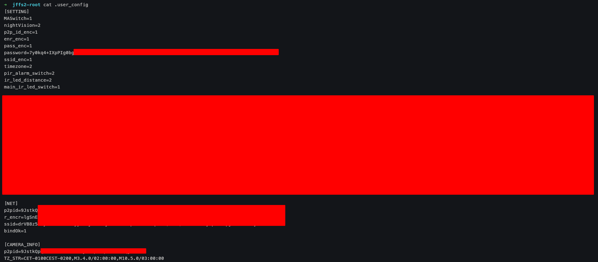

# Rooting a Wyze V3 Cam for fun

>[!WARNING]
>This document doesn't display any "vulnerability" but only the results of me trying to understand how the camera work and how to "play" with it. If someone from Wyze wants it removed, just send a mail to [theophile.wemaere@gmail.com](mailto:theophile.wemaere@gmail.com) and I'll remove it.

After seeing [this video](https://www.youtube.com/watch?v=hV8W4o-Mu2o), I wanted to try it myself to learn a bit about firmware patching. As no Cam V2 were available at the moment, I purchased a Cam V3 thinking it would be the same thing... and I was very much wrong.


<!--<div style="display: flex; justify-content: space-between;">
  <div style="flex: 1; background-color: #FF5733; display: flex; justify-content: center; align-items: center; padding: 2px; box-sizing: border-box;color:black">
    <strong>Root Shell ✅</strong>
  </div>
  <div style="flex: 1; background-color: #33FF57; display: flex; justify-content: center; align-items: center; padding: 2px; box-sizing: border-box;color:black">
    <strong>Bootloader Access ✅</strong>
  </div>
  <div style="flex: 1; background-color: #3357FF; display: flex; justify-content: center; align-items: center; padding: 2px; box-sizing: border-box;color:black">
    <strong>Wifi Credentials ✅</strong>
  </div>
  <div style="flex: 1; background-color: #FFFF33; display: flex; justify-content: center; align-items: center; padding: 2px; box-sizing: border-box;color:black">
    <strong>HTTPS Proxy ✅</strong>
  </div>-->


So here are the results of my approach to rooting this camera, and things I learned / discovered along the way.

## Table of contents

* [Camera Architecture and Firmware update](#Camera-Architecture-and-Firmware-update)
* [Getting UART logs and more](#Getting-UART-logs-and-more)
* [Attacking the bootloader with a glitching attack](#Attacking-the-bootloader-with-a-glitching-attack)
* [Firmware extraction from the bootloader](#Firmware-extraction-from-the-bootloader)
* [Firmware patching done the right way](#Firmware-patching-done-the-right-way)
* [Installing a proxy to monitor HTTPS traffic](#Installing-a-proxy-to-monitor-HTTPS-traffic)
## Camera Architecture and Firmware update

My original goal was to learn firmware patching by modifying a [Wyze firmware](https://support.wyze.com/hc/en-us/articles/360024852172-Release-Notes-Firmware#Accordion-cameras-14), but I discovered that on the V3, Wyze implemented firmware signature.
Meaning any firmware not signed with Wyze private key will not be accepted for update by the bootloader.
I was a bit disappointed, but as I purchased this camera with the only goal of hacking it, I still tried and ended up learning way more than planned. 

So, let's begin by looking at the camera main board architecture, and what chip / piece of hardware is interesting for testing purposes. I forgot to take clean picture when starting this project but luckily there are good photos on [https://fccid.io](https://fccid.io/2AUIUWYZEC3/Internal-Photos/Internal-Photos-5001016.pdf) :


One interesting thing for the futur is the flash chip on the top of the board :


It's a [MD25Q128](http://www.firstjit.com/Uploadfiles/20160121152131319.pdf) SPI Flash chip with a `SOP8` format. It's used to store the data for the device such as the bootloader, the linux kernel and the file systems. I will come back to it later.

But the first thing someone who know embedded devices would see are the 3 unconnected pins on the bottom :


On embedded device, that could be a UART connection :
> Universal Asynchronous Receiver/Transmitter, is a computer hardware device for asynchronous serial communication in which the data format and transmission speeds are configurable. The electric signaling levels and methods are handled by a driver circuit external to the UART.
> - [Wikipedia](https://en.wikipedia.org/wiki/Universal_asynchronous_receiver/transmitter)

UART is often found on IOT device and for developers to debug the device. You can usually access the bootloader and a shell if the running software support it, so that's a very good thing to find here. 

Could that be UART ? Well, some peoples on the internet already confirmed it was... so with a quick conductivity test, we can find the GND pins, and some signal analysis when the camera is powered, we can easily find the pin with traffic (TX) and the one without (RX). In the end, we get :


<!--<div style="display: flex; justify-content: space-between;">
  <div style="flex: 1; background-color: #33FF57; display: flex; justify-content: center; align-items: center; padding: 2px; box-sizing: border-box;color:black">
    <strong>GREEN : TX (<i>T</i>ransmit, outgoing traffic)</strong>
  </div>
  <div style="flex: 1; background-color: #3357FF; display: flex; justify-content: center; align-items: center; padding: 2px; box-sizing: border-box;color:black">
    <strong>BLUE : RX (<i>R</i>eceive, ingoing traffic)</strong>
  </div>
</div>-->


## Getting UART logs and more 

To connect to UART, I used `picocom` which is a easy to use terminal emulator, perfect for UART connection and analysis, but other tools can do that such as `screen`, `minicom`,...

```shell
picocom -b 115200 /dev/ttyUSB0 
```
Here the `-b` option is used to specify the baudrate, which is the speed used for the communication. The most standard value is `115200` but in case of negative results, it's possible to test other standard baudrate of calculate it using a logic analyzer or an oscilloscope.

Once I connected the pins to a UART to USB converter (very cheap piece of equipment), I was able to confirm the UART connection by seeing the boot logs of the camera.


<!---->
[Bootloader messages on UART](https://github.com/user-attachments/assets/655c739f-a51f-4fd9-aaad-3da7f2bb93b6)


In the logs, we can see the system booting and the different services of the camera starting up. We can even see the SSID of the Wifi network if connecting to, or get info on the linux system used :

```
## Booting kernel from Legacy Image at 80600000 ...
   Image Name:   Linux-3.10.14__isvp_swan_1.0__
   Image Type:   MIPS Linux Kernel Image (lzma compressed)
   Data Size:    1897330 Bytes = 1.8 MiB
   Load Address: 80010000
   Entry Point:  80416900
   Verifying Checksum ... OK
   Uncompressing Kernel Image ... OK
```

The boot logs specify the use of `U-boot`, which is an open-source boot loader, often used in embedded devices.


Accessing the boot loader is usually a big step because it allow for memory and firmware dumps, and also modifying the init process of the OS, which could allow for an easy root shell.

To interrupt the boot process and access the bootloader, I looked for this kind of message :


This usually allow the user to stop the boot process, but in this case the timer is always at 0, not allowing a user to press a key.
At first I thought the time window was very short but still possible, so I tried to bruteforce it buy automating the key sending with python, but it did not work
I then tried to bruteforce with all key or common key combination (`U-boot` can be configured to only react to `Ctrl+U` for example, so even if the prompt say `any-key` I tried it) but it didn't work either.

So the bootloader seemed protected from access via auto boot interruption.
But if the software is not helping, maybe hardware can help ?
Time to glitch !

## Attacking the bootloader with a glitching attack

The bootloader menu cannot be accessed directly as Wyze seems to have locked it.
But we can actually access it by forcing the device to go into rescue mode.
Rescue mode will be used if the device cannot boot as intended, for example if the kernel partition is corrupted and the system cannot boot properly.

The easiest way to access the rescue mode is to make the bootloader think he cannot access the SPI flash chip to load the kernel in memory and boot. That way, no data is modified / corrupted but the bootloader still think something is wrong and start the rescue mode, letting us access the menu.

To do so, I used a simple method called "Glitching", which consist on wiring the data output pin of the SPI flash chip to the ground (GND), that way the CPU cannot receive data from the SPI chip and drop in the boot menu.

But we cannot just solder a wire to the chip, because we need to let the device first load the bootloader code in memory, and then when the bootloader try to load the kernel, we interrupt the communication with glitching :


For the glitch to work, we need the outgoing data to not reach the device processor by wiring the "TX" pin of the SPI chip to GND.
Looking at the [chip documentation](http://www.firstjit.com/Uploadfiles/20160121152131319.pdf), we find the pins we need to wire :


The pin SO (Signal Out) and VSS (GND) can be found on the same side of the chip.

To glitch, we can use test probes/claws to avoid aving to solder to the chip (the format of the chip allow it) :

<!---->
[Setting up probes for glitching](https://github.com/user-attachments/assets/1a02b75b-1c36-48be-badc-6e605f0cfc87)

Then we can simply make contact between the two wires manually, or using a switch / button :


If the operation needed to be done in a very short time, I would have used a microcontroller (like an arduino) with a relay or a transistor to automate the process, but it was not needed here. 

Once the setup is in place, we just need to glitch the camera once the bootloader has been loaded and will try to load the kernel. In short, the glitch need to be done after the following line has been seen :
```
Hit any key to stop autoboot:  0 
```

The glitching in action :

<!---->
[Glitching in action](https://github.com/user-attachments/assets/f6d14471-2ae4-4031-b510-ad0a4001d506)

And it work !
We can see the error message :
```
ERROR: can't get kernel image!
```
And after that a prompt for the boot menu. 

## Firmware extraction from the bootloader 

Now I know the firmware is accessible on the internet on Wyze website so it's nothing new, and I'm not gonna go too much into firmware structure / analysis, again it's available on Wyze website. I still wanted to learn how to extract the firmware via the bootloader. And I still found some weird thing.

Actually it's not that hard to dump the whole firmware :
- Find the address of the partitions
- Python script to interact with the bootloader and dump the partitions
- Done

The address of the partitions can be found :
- in the bootloader bootargs env (seen with the command printenv) :
```shell
isvp_t31# printenv

<SNIP>
bootargs=console=ttyS1,115200n8 mem=80M@0x0 rmem=48M@0x5000000 init=/linuxrc rootfstype=squashfs root=/dev/mtdblock2 rw mtdparts=jz_sfc:256K(boot),1984K(kernel),3904K(rootfs),3904K(app),1984K(kback),3904K(aback),384K(cfg),64K(para)
<SNIP>

Environment size: 562/4092 bytes
```
- in the kernel loading logs :


The partitions being :

| Partition | Size    | Size Hex | Purpose                                 |
| --------- | ------- | -------- | --------------------------------------- |
| `boot`    | 256 KB  | 0x40000  | Bootloader       |
| `kernel`  | 1984 KB | 0x1F0000 | Primary Linux kernel image              |
| `rootfs`  | 3904 KB | 0x3D0000 | Root filesystem                         |
| `app`     | 3904 KB | 0x3D0000 | Application data |
| `kback`   | 1984 KB | 0x1F0000 | Backup Linux kernel image               |
| `aback`   | 3904 KB | 0x3D0000 | Backup application data                 |
| `cfg`     | 384 KB  | 0x60000  | Configuration data|
| `para`    | 64 KB   | 0x10000  | parameters ? |

To read a partition content, we need to :
- load the partition in memory at a given address using the `sf` command
- use the `md` (memory display) command to display the content of the memory and actually see what we have loaded

So for example to read the `rootfs` partitions :
```shell
sf read 0x80000000 0x0 0x40000
md.b 0x80000000 0x40000
```
- `sf read` :
	- `0x80000000` : where to load data in the memory
	- `0x0` : start of the partition in the flash
	- `0x40000` : size of the data to read
- `md.b` :
	- `0x80000000` : where to start reading
	-`0x40000` : size of the data to read 

Then to load the following partition just take :
```math
start\_part_n = start\_part_{n-1} + size\_part_{n-1}  
```
to get the start of the next partition, and so on.
So for example to get the start of the partition `kernel` (after `boot`) :
```math
	start\_kernel = start\_boot + size\_boot = 0\text{x}0 + 0\text{x}40000 = 0\text{x}40000
```
And for the third partition (`rootfs`) :
```math
	start\_kernel = start\_kernel + size\_kernel = 0\text{x}40000 + 0\text{x}1F0000 = 0\text{x}230000
```
and so on...

With this in mind, we can easily dump partition and recreate them with a python script.

To dump a particular partition, I created the python script [extract.py](utils/extract.py) :


That way I can dump every partition one by one and examine them.
I still wanted to learn how to do this because some devices don't have a public firmware available on the internet so that's something I wanted to try.

To read the whole firmware, I first used another (more primal) method consisting in dumping all partitions one by one and recording the output from `picocom` to a file, and then use a python script to extract data from the log file and create a binary image of the firmware with it.

The [extract.py](utils/extract.py) can generate a one line command to dump all the partition : 
```shell
$ python extract.py oneliner

sf probe
sf read 0x80000000 0x0 0x40000;md.b 0x80000000 0x40000;sf read 0x80000000 0x40000 0x1F0000;md.b 0x80000000 0x1F0000;sf read 0x80000000 0x220000 0x3D0000;md.b 0x80000000 0x3D0000;sf read 0x80000000 0x600000 0x3D0000;md.b 0x80000000 0x3D0000;sf read 0x80000000 0x9C0000 0x1F0000;md.b 0x80000000 0x1F0000;sf read 0x80000000 0xBA0000 0x3D0000;md.b 0x80000000 0x3D0000;sf read 0x80000000 0xF60000 0x60000;md.b 0x80000000 0x60000;sf read 0x80000000 0xFC0000 0x10000;md.b 0x80000000 0x10000;
```

Then simply open a UART shell (with logs to a specific file) and run the command (take a few hours) :

<!---->
[Dumping with oneliner](https://github.com/user-attachments/assets/735d2f93-94d9-497f-a3fa-db614cc0a961)

And once the dump is over, I created another python script [translate.py](utils/translate.py) :


This is not a perfect method, but it was enough to run a first analysis with `binwalk` :


#### Some info about the firmware :

All the filesystem are mounted read-only except one:
- `rootfs`, mounted on `/` : the root filesystem
- `app`, mounted on `/system` : the FS with all binaries and files from Wyze
- `cfg`, mounted on `/configs` : store users data such as SSID, time zone, ...
	- This filesystem can written, perfect for a backdoor

When analyzing the config partition after dumping it, I discovered several things :

**Encrypted Wifi credential**

The `cfg` partition is a JFFS2 filesystem :


Inside are multiples files related to the camera config, but also a `user_config` file with the wifi credentials inside :



Those are encrypted with a custom method from Wyze, but weirdly, when looking at the whole dump from the `binwalk` extract on the full firmware (done with `translate.py`), I found the credentials of the first wifi network I used with this camera, in plain text :


The output is a bit broken but there was trace of old file (`.wifissid` and `.wifipasswd`) with the plaintext wifi credentials inside. Now the firmware use encryption, but I guess this was the previous firmware version which didn't used it, and even tough the update now add encryption for this, there was still trace of the old plaintext files.

My guess is help by the fact that those are the credentials for the first wifi network I used for this camera (also why I can't show them).

Moreover, the file `/init/wifi.sh` in the `app` partition show that thoses files where used previously :
```shell
#! /bin/sh

rewrite_config_value()
{
    file=$1
    key=$2
    newvalue=$3
    if [ -f $file ]; then
        sed -i "s/$key=.*/$key=$newvalue/g" $file
    fi
}

cp -rf /system/bin/wpa.conf /tmp/wpa.conf

wpaconf_file=/tmp/wpa.conf
wifissid=$(cat /configs/.wifissid)
wifipasswd=$(cat /configs/.wifipasswd)

rewrite_config_value $wpaconf_file  ssid  "\"$wifissid\""
rewrite_config_value $wpaconf_file  psk  "\"$wifipasswd\""
rewrite_config_value $wpaconf_file  scan_ssid  1

ifconfig wlan0 up
wpa_supplicant -D nl80211 -iwlan0 -c /tmp/wpa.conf -B &
sleep 3
udhcpc -i wlan0
```

This script is still present in the firmware, but doesn't seem to be used anywhere in the different binaries/scripts on the camera.
But we can see it clearly used files like `.wifipasswd` and `.wifissid` to store wifi credentials.

So that could be one way to find the decrypted credentials.
Another way would be to reverse wyze encryption algorithm but I found a faster solution.
Patching the firmware to add a backdoor and get a root shell.

## Firmware patching done the right way

My first attempt was to patch the firmware by using the bootloader menu.
In fact we can use it to read memory, but also update memory on the SPI flash. 
But I encountered a lot of bugs due to memory update of the SPI, and I still didn't found the time to code a nice python script to fix that.

So I looked online how peoples usually do this kind of thing properly, and after buying a 10€ flash programmer on amazon, I found the simplest way to patch the firmware.

I used a CH314A Flash programmer, which is a well know tool used to update BIOS chip and other SOP8/SOIC8 flash chip :


As we saw for the glitching attack on the flash chip, it's easily accessible so it was not too difficult to get the connector on it :


Once the clip is in place, I used the tool `flashrom` to dump the flash memory :
```shell
flashrom -r output.bin -p ch341a_spi -c "GD25B128B/GD25Q128B"
```


This is a safest / faster way to dump the whole firmware, but when I started this project I didn't owned a flash programmer.

And if we can read the flash, we can certainly write it. Time to update the firmware our way.

**Before doing any firmware modification, always keep a clean version of the original firmware in case you brick the device, that way you can always rewrite the original firmware**

The easiest way to root the camera is to remove the need for a password and/or a login prompt. For that we need to :
- Extract the root filesystem from the whole firmware
- Update files we want
- Repack it
- Rewrite it inside the firmware

This can be done with `binwalk` and `dd` :


From various test or just by guessing from sizes, the root filesystem is the one starting from `2293760` with a size of `2881448` bytes.
We can extract only this portion with :
```shell
dd if=output.bin of=rootfs.bin bs=1 skip=2293760 count=2881448
```
and then extract the filesystem with :
```shell
unsquashfs rootfs.bin
```


Then in the newly created folder, you can find the filesystem.
The easiest ways to get a root shell are :
- Method 1 : remove the need for password for the user root. This can be done by removing the `x` in `/etc/passwd` :
```shell
# before modification
root:x:0:0:root:/:/bin/sh

# after modification (the x specify is the user need a password to login)
root::0:0:root:/:/bin/sh
```
- Method 2 : remove the login prompt. Instead of a login prompt on UART, we can directly set a shell. We can modify the file `/etc/inittab` for that :
```shell
# before modification
console::respawn:/sbin/getty -L console 115200 vt100 # GENERIC_SERIAL

# after modification
console::respawn:/bin/sh
```

Whatever you decide, once the change as been made, we need to repack the filesystem.
This can be done with :
```shell
mksquashfs squashfs-root/ newrootfs.bin -comp xz
```

And then rewrite the newly created rootfs to a new firmware :
```shell
cp output.bin newfw.bin # always keep the original in case
dd if=newrootfs.bin of=newfw.bin bs=1 seek=2293760 count=2881448 conv=notrunc
```
Then you just need to write the new firmware and that should be it :
```shell
flashrom -w newfw.bin -p ch341a_spi -c "GD25B128B/GD25Q128B"
```

Once the new firmware is in place, I powered up the camera and got the root shell I waited so long for :

<!---->
[Rooting the camere](https://github.com/user-attachments/assets/07af444b-7c9d-4ae7-8be1-8e4e5a129d3b)

With a root shell, I was now able to see the running process and what's happening in the camera while it's in use.

I found a lot of interesting things in the `/tmp` directory, normally not available as it only exist when the device is running normally :
- the plaintext wifi credentials can be found in `/tmp/wpa_supplicant.conf` :


- a file with a lot of certificate that I understood later is used to store allowed SSL certificate for HTTPS. From that, I was able to install a proxy and capture the traffic of the camera
## Installing a proxy to monitor HTTPS traffic 

Now that the device is rooted and we access the internal filesystem, one more thing to do is find a way to intercept the communication between the device and the remote server in the cloud.

When looking at the init scripts, I found some interesting lines in `/etc/init.d/rcS `: 
```shell
<SNIP>
# Set Global Environment
export PATH=/bin:/sbin:/usr/bin:/usr/sbin
export PATH=/system/bin:$PATH
export LD_LIBRARY_PATH=/system/lib
export LD_LIBRARY_PATH=/thirdlib:$LD_LIBRARY_PATH
<SNIP>
```

Those are the environment variables for the different process running on the camera.
We can use this script to add some variables to help us intercept the traffic.

In Linux system, if the variables `HTTP_PROXY` or `HTTPS_PROXY` are set, traffic should be redirected to the given proxy. That's the simplest way to add proxy routing in a linux system.

For easier testing purposes, I modified the `/etc/init.d/rcS` script to try and load another script located in `/configs/` so I was able to modify the parameters in real time instead of having to re-flash the firmware each time (`cfg` partition is the only writable partition).

To do so, I modified the init script by adding the following line :
```shell
# Mount configs partition
mount -t jffs2 /dev/mtdblock6 /configs

if [[ -f /configs/a.sh ]]; then source /configs/a.sh; fi
```
The last line check if the script `a.sh` exists in the cfg partition, and run it if it is found.
- The check must be done **after** the `cfg` partition is mounted on the filesystem (like here)
- I used `source /configs/a.sh` instead of just `sh /configs/a.sh` to be able to inherit of any environment variables set in `a.sh`.

Once I modified the init script and re-flashed the firmware (as shown before), I could add the script `a.sh` in `/configs/` (using `vi`) :


And if everything has been done correctly, the script should execute at camera initialization :


Now to go back to the initial goal : intercepting the HTTP traffic.
As said before, we can use the `HTTP_PROXY` and `HTTPS_PROXY` variables and set them in `a.sh` so any process launched at initialization inherent them and use them :


On my computer (at `192.168.1.167`), I setup [BurpSuite](https://portswigger.net/burp) with the proxy listening on port `8081` on all interfaces :


And after rebooting the camera, I should have the traffic routed to my BurpProxy.
One problem however... the device use HTTPS for most of the requests.
And the one of the main goal of HTTPS is to avoid man in the middle, like I'm trying to do. And as the BurpProxy use a non trusted certificate authority (CA), no HTTPS requests will be sent to my proxy :


So, to be able to intercept HTTPS traffic, we need to add Burp CA to the list of trusted CA in the devices.

From my research in the device, I discovered that the list of certificates used by the devices (for the remote servers) and generated at runtime in the file `/tmp/cacert.pem` :


Inside this file are 138 certificates :


I know the file `/tmp/cacert.pem` is generated by one of the Wyze binary at runtime, so using the previously created `a.sh` script, I can launch a function that :
- check if the file `/tmp/cacert.pem` has been generated
- once the file has been found, inject the BurpSuite certificate inside it

To get the BurpSuite certificate as a PEM file, we can do the following commands :
```shell
# get the DER certificate on the proxy address
wget http://192.168.1.167:8081/cert -O certificate.der
# convert it to PEM with openssl
openssl x509 -inform DER -in certificate.der -out burp.pem 
```

Then, transfer it to the device inside the `/configs` folder, and modify the `a.sh` script :
```shell
check_cacert() {
    while true
    do
      if [[ -f /tmp/cacert.pem ]]
      then
          echo '************************************** file has been found'
          cat /configs/burp.pem >> /tmp/cacert.pem
          exit
      fi
      sleep 0.1
    done
}

echo "********************* PWN3D **********************"
export http_proxy="http://192.168.1.167:8081"
export https_proxy="http://192.168.1.167:8081"

check_cacert &
# check if the env variables have been set
env
```

The function `check_cacert` check if the file `/tmp/cacert` has been generated, and sleep 10 milliseconds if not, else it inject the burp certificate inside it.

Once everything has been setup as shown, the device can be rebooted and if everything has been done correctly, the BurpSuite proxy should receive incoming requests as the CA has been added to device list of trusted CA :


We can see that the `HTTP_PROXY` and `HTTPS_PROXY` variables has been set correctly, and the certificate has been injected correctly inside the device trusted CA list.
With that done, the BurpProxy should be receiving HTTPS from the device to the remote API :


With this setup (root shell and HTTPS proxy), I can now explore in depth how the camera work. That's all for this writeup !